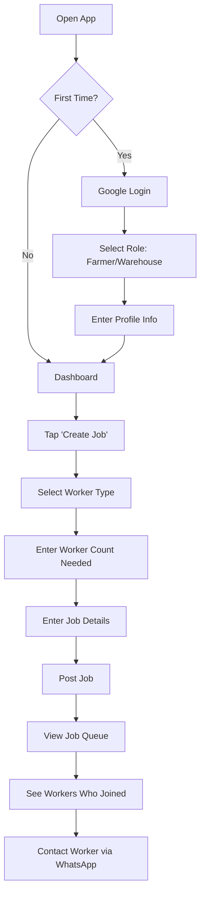
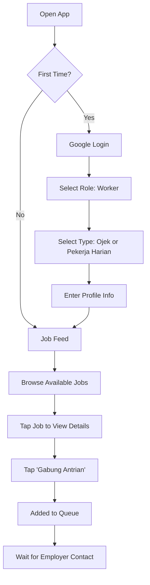

# OjekHub - Phase 2: User Roles

## Authentication

| Rule             | Implementation                       |
| ---------------- | ------------------------------------ |
| Login method     | Google Sign-In only                  |
| Role selection   | After first login, user selects role |
| Role persistence | Cannot change role after selection   |

---

## User Roles

### 1. Farmer (Petani)

| Attribute            | Definition                                          |
| -------------------- | --------------------------------------------------- |
| **Who**              | Agricultural land owners needing labor              |
| **Primary action**   | Create job orders for harvest, planting, transport  |
| **Responsibilities** | Post accurate job details, contact workers directly |
| **Cannot do**        | Join job queues, see other farmers' orders          |

### 2. Warehouse (Gudang)

| Attribute            | Definition                                          |
| -------------------- | --------------------------------------------------- |
| **Who**              | Storage facility operators needing labor            |
| **Primary action**   | Create job orders for loading, unloading, transport |
| **Responsibilities** | Post accurate job details, contact workers directly |
| **Cannot do**        | Join job queues, see other warehouses' orders       |

### 3. Worker (Pekerja)

| Attribute            | Definition                              |
| -------------------- | --------------------------------------- |
| **Who**              | Individuals seeking work opportunities  |
| **Primary action**   | Browse and join job queues              |
| **Responsibilities** | Respond to jobs, show up when committed |
| **Cannot do**        | Create job orders                       |

---

## Worker Types

### Ojek (Motorcycle Driver)

| Attribute          | Definition                                   |
| ------------------ | -------------------------------------------- |
| **Work type**      | Transportation and delivery                  |
| **Typical tasks**  | Move goods between farm ↔ warehouse ↔ market |
| **Requirement**    | Has motorcycle                               |
| **Job visibility** | Only sees jobs tagged "Ojek"                 |

### Pekerja Harian (Daily Laborer)

| Attribute          | Definition                             |
| ------------------ | -------------------------------------- |
| **Work type**      | Physical labor                         |
| **Typical tasks**  | Harvest, loading, unloading, sorting   |
| **Requirement**    | Physical ability to work               |
| **Job visibility** | Only sees jobs tagged "Pekerja Harian" |

---

## User Journeys

### Farmer / Warehouse Flow



**Step-by-step:**

1. Open app → Login with Google
2. First-time: Select role (Farmer or Warehouse)
3. Fill profile: Name, location, phone (WhatsApp)
4. From dashboard: Tap **"Buat Lowongan"** (Create Job)
5. Select worker type: Ojek or Pekerja Harian
6. Enter how many workers needed
7. Add job details: Description, location, date
8. Post job → Job appears in worker feeds
9. View queue of workers who joined
10. Tap worker name → Open WhatsApp chat

---

### Worker Flow



**Step-by-step:**

1. Open app → Login with Google
2. First-time: Select role (Worker)
3. Select worker type: Ojek or Pekerja Harian
4. Fill profile: Name, location, phone (WhatsApp)
5. See job feed (filtered by worker type)
6. Browse jobs with details: Location, date, employer
7. Tap **"Gabung Antrian"** (Join Queue)
8. You're added to the job's queue
9. Employer sees you in queue list
10. Employer contacts you via WhatsApp

---

## Flow Rules Summary

| Rule                     | Description                         |
| ------------------------ | ----------------------------------- |
| **One role per user**    | Cannot be both employer and worker  |
| **Worker type is fixed** | Selected once during registration   |
| **Job filtering**        | Workers only see matching job types |
| **Queue is first-come**  | Display order = join order          |
| **No in-app chat**       | Contact happens via WhatsApp        |
| **No tracking**          | App's job ends at connection        |

---

## Data Model Preview

```
User
├── id (Google UID)
├── name
├── phone (WhatsApp)
├── location
├── role: "farmer" | "warehouse" | "worker"
└── workerType?: "ojek" | "daily" (only if worker)

Job
├── id
├── employerId
├── workerType: "ojek" | "daily"
├── workerCount
├── description
├── location
├── date
├── status: "open" | "closed"
└── createdAt

JobQueue
├── jobId
├── workerId
└── joinedAt
```
