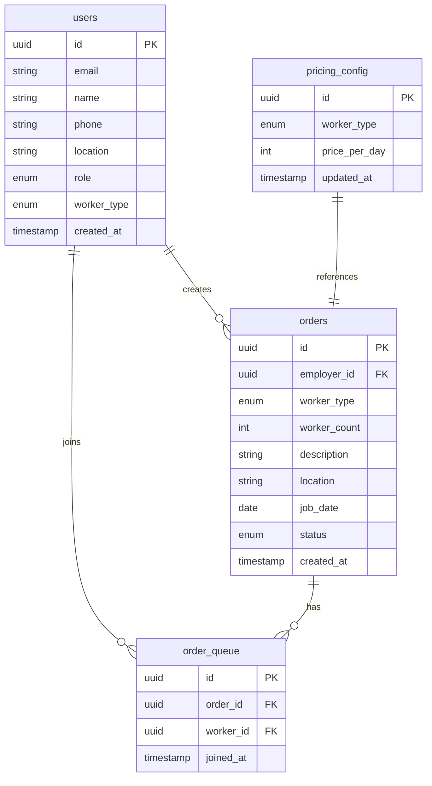

# OjekHub - Phase 4: ERD

## Entity Relationship Diagram



---

## Table Definitions

### 1. `users`

| Column        | Type         | Constraints                    | Description                        |
| ------------- | ------------ | ------------------------------ | ---------------------------------- |
| `id`          | UUID         | PK, DEFAULT uuid_generate_v4() | Supabase Auth UID                  |
| `email`       | VARCHAR(255) | NOT NULL, UNIQUE               | Google email                       |
| `name`        | VARCHAR(100) | NOT NULL                       | Display name                       |
| `phone`       | VARCHAR(20)  | NOT NULL                       | WhatsApp number                    |
| `location`    | VARCHAR(100) | NOT NULL                       | Area/village name                  |
| `role`        | ENUM         | NOT NULL                       | `farmer`, `warehouse`, `worker`    |
| `worker_type` | ENUM         | NULLABLE                       | `ojek`, `daily` (only for workers) |
| `created_at`  | TIMESTAMP    | DEFAULT NOW()                  | Registration time                  |

### 2. `orders`

| Column         | Type         | Constraints                    | Description              |
| -------------- | ------------ | ------------------------------ | ------------------------ |
| `id`           | UUID         | PK, DEFAULT uuid_generate_v4() | Unique order ID          |
| `employer_id`  | UUID         | FK → users.id, NOT NULL        | Creator of the order     |
| `worker_type`  | ENUM         | NOT NULL                       | `ojek`, `daily`          |
| `worker_count` | INT          | NOT NULL, CHECK > 0            | Number of workers needed |
| `description`  | TEXT         | NOT NULL                       | Job description          |
| `location`     | VARCHAR(100) | NOT NULL                       | Job location             |
| `job_date`     | DATE         | NOT NULL                       | When work is needed      |
| `status`       | ENUM         | DEFAULT 'open'                 | `open`, `closed`         |
| `created_at`   | TIMESTAMP    | DEFAULT NOW()                  | Order creation time      |

### 3. `order_queue`

| Column      | Type      | Constraints                    | Description             |
| ----------- | --------- | ------------------------------ | ----------------------- |
| `id`        | UUID      | PK, DEFAULT uuid_generate_v4() | Queue entry ID          |
| `order_id`  | UUID      | FK → orders.id, NOT NULL       | Which order             |
| `worker_id` | UUID      | FK → users.id, NOT NULL        | Which worker            |
| `joined_at` | TIMESTAMP | DEFAULT NOW()                  | Queue position          |
| -           | -         | UNIQUE(order_id, worker_id)    | Prevent duplicate joins |

### 4. `pricing_config`

| Column          | Type      | Constraints                    | Description     |
| --------------- | --------- | ------------------------------ | --------------- |
| `id`            | UUID      | PK, DEFAULT uuid_generate_v4() | Config ID       |
| `worker_type`   | ENUM      | NOT NULL, UNIQUE               | `ojek`, `daily` |
| `price_per_day` | INT       | NOT NULL                       | Price in IDR    |
| `updated_at`    | TIMESTAMP | DEFAULT NOW()                  | Last update     |

---

## Enum Definitions

```sql
CREATE TYPE user_role AS ENUM ('farmer', 'warehouse', 'worker');
CREATE TYPE worker_type AS ENUM ('ojek', 'daily');
CREATE TYPE order_status AS ENUM ('open', 'closed');
```

---

## Relationships

| Relationship                | Type | Description                       |
| --------------------------- | ---- | --------------------------------- |
| `users` → `orders`          | 1:N  | One employer creates many orders  |
| `users` → `order_queue`     | 1:N  | One worker joins many queues      |
| `orders` → `order_queue`    | 1:N  | One order has many queue entries  |
| `pricing_config` → `orders` | 1:1  | Order's worker_type maps to price |
