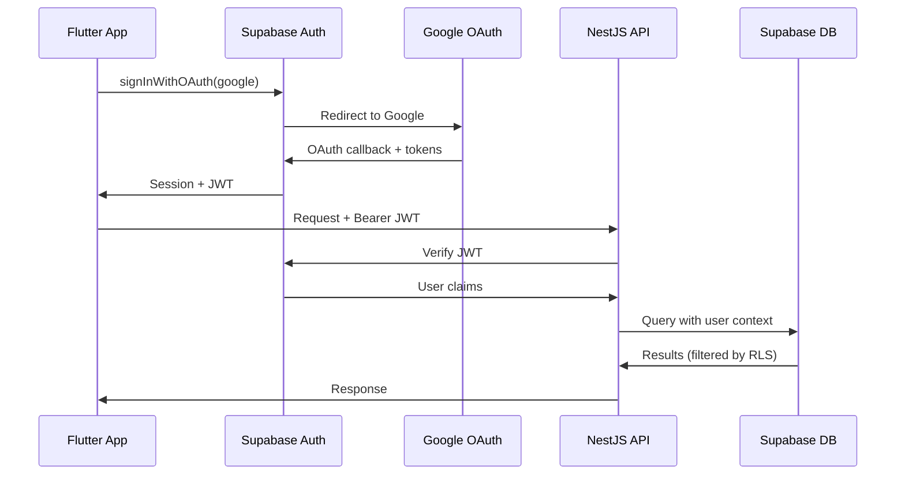

# OjekHub - Phase 5: Auth and Access

## Authentication Flow



---

## Login Flow (Step-by-Step)

### First-Time User

| Step | Action                  | Result                      |
| ---- | ----------------------- | --------------------------- |
| 1    | Tap "Login with Google" | Supabase OAuth popup        |
| 2    | Select Google account   | Supabase creates user       |
| 3    | Check if profile exists | No → Show role selection    |
| 4    | Select role             | farmer / warehouse / worker |
| 5    | If worker → Select type | ojek / daily                |
| 6    | Fill profile form       | Name, phone, location       |
| 7    | Submit profile          | INSERT into `users` table   |
| 8    | Redirect to dashboard   | Based on role               |

### Returning User

| Step | Action           | Result                    |
| ---- | ---------------- | ------------------------- |
| 1    | Open app         | Check stored session      |
| 2    | Session valid?   | Yes → Go to dashboard     |
| 3    | Session expired? | Auto-refresh via Supabase |
| 4    | No session?      | Show login screen         |

---

## Authorization Rules

### Role-Based Access Matrix

| Endpoint                   | Farmer   | Warehouse | Worker   |
| -------------------------- | -------- | --------- | -------- |
| `GET /users/me`            | ✅       | ✅        | ✅       |
| `PUT /users/me`            | ✅       | ✅        | ✅       |
| `POST /orders`             | ✅       | ✅        | ❌       |
| `GET /orders` (own)        | ✅       | ✅        | ❌       |
| `GET /orders` (by type)    | ❌       | ❌        | ✅       |
| `DELETE /orders/:id`       | ✅ (own) | ✅ (own)  | ❌       |
| `POST /orders/:id/queue`   | ❌       | ❌        | ✅       |
| `DELETE /orders/:id/queue` | ❌       | ❌        | ✅ (own) |
| `GET /orders/:id/queue`    | ✅ (own) | ✅ (own)  | ❌       |

### Access Rules Summary

| Rule                                | Description                                                |
| ----------------------------------- | ---------------------------------------------------------- |
| **Employers see own orders**        | `WHERE employer_id = auth.uid()`                           |
| **Workers see matching jobs**       | `WHERE worker_type = user.worker_type AND status = 'open'` |
| **One queue entry per order**       | UNIQUE constraint + check before insert                    |
| **Only order owner can view queue** | `WHERE order.employer_id = auth.uid()`                     |

---

## NestJS JWT Validation

### Auth Guard Implementation

```typescript
// auth.guard.ts
@Injectable()
export class SupabaseAuthGuard implements CanActivate {
  constructor(private supabase: SupabaseService) {}

  async canActivate(context: ExecutionContext): Promise<boolean> {
    const request = context.switchToHttp().getRequest();
    const token = this.extractToken(request);

    if (!token) throw new UnauthorizedException();

    const {
      data: { user },
      error,
    } = await this.supabase.auth.getUser(token);

    if (error || !user) throw new UnauthorizedException();

    request.user = user;
    return true;
  }
}
```

### Role Guard Implementation

```typescript
// role.guard.ts
@Injectable()
export class RoleGuard implements CanActivate {
  constructor(private reflector: Reflector) {}

  canActivate(context: ExecutionContext): boolean {
    const roles = this.reflector.get<string[]>("roles", context.getHandler());
    if (!roles) return true;

    const request = context.switchToHttp().getRequest();
    const userRole = request.user.role;

    return roles.includes(userRole);
  }
}
```
